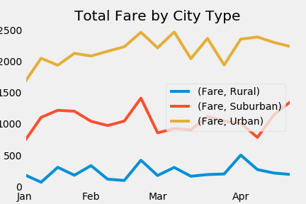

# Ride Sharing Analysis

## Summary Data Frame
The data in the summary DataFrame depicts that there were more total rides and drivers in urban cities than in suburban cities, and more total rides and drivers in suburban cities than rural cities. This pattern of urban > suburban > rural holds true for total fares as well. However, the average fare per ride was greatest in rural cities, then suburban cities, and least in urban cities. Further, the average fare per driver had a greater significant difference between values, with the greatest in rural cities, then suburban cities, and least in urban cities, as well.

## Fares Over Time for City Types
  
This graph depicts that in the first four months of the year trends are mostly steady with a slow decline at the beginning of February and a peak at the end of February for each city type. Trends are not very volatile and mostly vary around one number for each city type, with urban at the top, suburban second, and rural last. 
